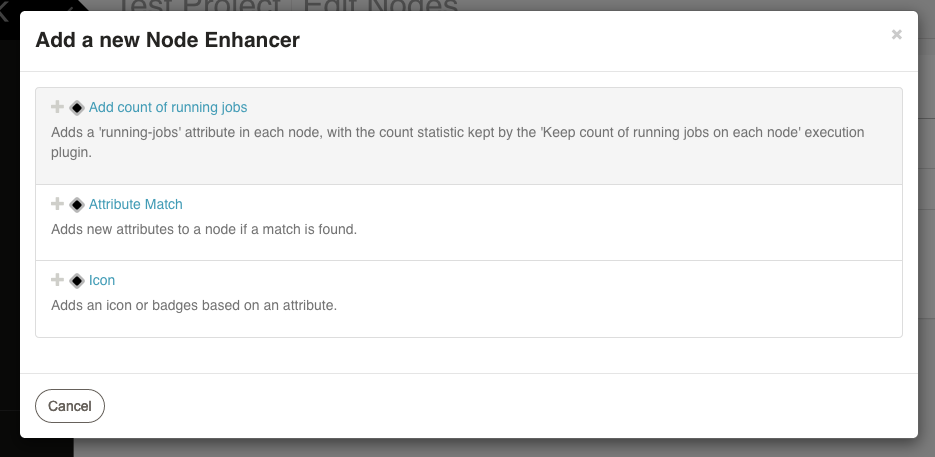

# Rundeck Running Jobs on Node Plugin

This plugin set provides a way to track the number of running jobs on each node, and add this stat to node attributes.

## Usage

- After installing the plugin, go to the `Edit Nodes...` section under the `Project Settings` menu, and select the the `Enhancers` tab.


- Click on `Add new Node Enhancer`. Select the `Add count of running jobs` enhancer, and click `Save`.



- Go to the job edition page on each job you want to enable tracking, and enable the `Keep count of running jobs on each node` option under the `Execution Plugins` tab. Save the job.


- You will now find the `running-jobs` attribute available on all nodes, with the count of currently running jobs.


## Building and Installing

To build the plugin, run the gradle build command:
```
./gradlew clean build
```
The resulting artifact will be found at `build/libs/running-jobs-node-enhancer-VERSION.jar`

For installing, copy the jar artifact to $RDBASE/libext directory of your rundeck installation.

See the [Included Plugins | Rundeck Documentation](http://rundeck.org/docs/plugins-user-guide/installing.html#included-plugins "Included Plugins") for more information on installing rundeck plugins.

